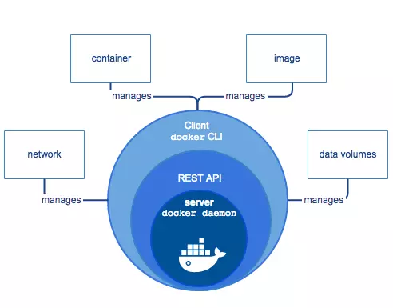
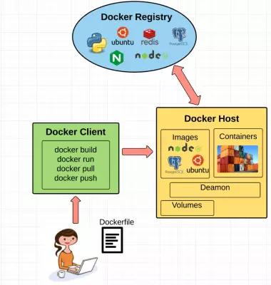
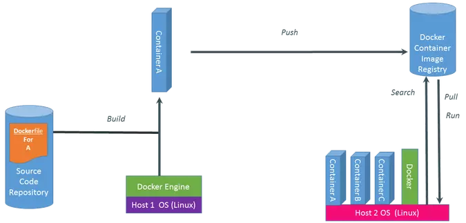

## Giới thiệu Docker

### Docker là gì? 

Docker là nền tảng cung cấp công cụ, service để các developers, admin systems có thể phát triển thực thi, chạy các ứng dụng với containers. Hay nói một cách khác nó là một nền tảng để cung cấp cách để building, deloy và run các ứng dụng một cách dễ dàng trên nền tảng ảo hoá - "Build once, run anywhere". Hay nói một cách dễ hiểu như sau: Khi chúng ta chạy app thì chúng ta phải thiết lập môi trường chạy cho nó. Thay vì chúng ta phải thiết lập môi trường chạy cho nó thì chúng ta sẽ chạy docker

Ứng dụng docker chạy trong vùng chứa (container) có thể được sử dụng trên bất kì hệ thống nào: máy tính xách tay của nhà phát triển, hệ thống trên cơ sở hoặc trong hệ thống đám mây. Và là một công cụ tạo môi trường được "đóng gói" (còn gọi là Container) trên máy tính mà không làm tác động tới môi trường của máy, môi trường trong Docker sẽ chạy độc lập.

Docker có thể làm việc trên nhiều nền tảng như Linux, Microsoft Windows và Apple OS X

Những nhiệm vụ trên của Docker cũng có thể được thực hiện thông qua Virtualization (Ảo hoá). Vậy thì tại sao lại chọn Docker?

### Các thành phần cơ bản của Docker

#### Docker Engine


Docker engine là một ứng dụng client-server. Có 2 phiên bản phổ bến:
+ Docker Community Edition (CE): Là phiên bản miễn phí và chủ yếu dựa vào các sản phẩm nguồn mở khác
+ Docker Enterprise (EE): Khi sử dụng phiên bản này bạn sẽ nhận ược sự support của nhà phát hành, có thêm các tính năng quản lý và security

Các thành phần chính của Docker Engine
+ Server hay còn gọi là docker daemon: chịu trách nhiệm tạo, quản lý các Docker objects như images, containers, networks, volumns.
+ REST API; docker daemon cung cấp các api cho các Client sử dụng để thao tác với Docker
+ Client là thành phần đầu cuối cung cấp một tập hợp các câu lệnh sử dụng api để người dùng thao tác với Docker

#### Distribution tools
+ Là công cụ phân tán giúp chúng ta lưu trữ và quản lý các Docker Images như: Docker Registry, Docker Trusted Registry, Docker Hub
+ Docker Hub là một công cụ phần mềm như môt dịch vụ cho phép người ta public hay private các images của chúng ta.
Dịch vụ cung cấp hơn 100.000 ứng dụng có sẵn công khai, cũng như các cơ quan đăng kí container cộng đồng và tư nhân

#### Orchestration tools

Docker Machine
```
Docker Machine: Machine tạo Docker Engine trên laptop của bạn hoặc trên bất cứ dịch vụ cloud phổ biến nào như AWS, Azure, Google Cloud, Softlayer
hoặc trên hệ thống data center như VMware, OpenStack. Docker Machine sẽ tạo các máy ảo và cài Docker Engine lên chúng và cuối cùng nó sẽ cấu hình 
Docker Client để giao tiếp với Docker Engine một cách bảo mật 
```

Docker Compose
```
Docker Compose: là công cụ giúp định nghĩa và khởi chạy multi-container Docker applications
```

Docker Swarm
```
Docker Swarm: là một công cụ giúp chúng ta tạo ra một clustering Docker. Nó giúp chúng ta gom nhiều Docker.
Nó giúp chúng ta gom nhiều Docker Engine lại với nhau và ta có thể "nhìn" nó như tư duy nhất một virtual Docker Engine
```

#### Một số thành phần khác 
Dockerfile 
```
Dockerfile : như một script dùng để build các image trong container. Dockerfile bao gồm các câu lệnh liên tiếp nhau được thực hiện tự động trên một image gốc để tạo ra một image mới. Dockerfile giúp đơn giản hóa tiến trình từ lúc bắt đầu đến khi kết thúc
```

Docker Toolbox
```
Docker Toolbox : Bởi vì Docker Engine dùng một số feature của kernel Linux nên ta sẽ không thể chạy Docker Engine natively trên Windows hoặc BSD được. Ở các phiên bản trước đây thì ta sẽ cần một máy ảo cài một phiên bản Linux nào đó và sau đó cài Docker Engine lên máy ảo đó
```

### Kiến trúc của Docker


Docker Daemon
```
Docker Daemon: lắng nghe các yêu cầu từ Docker Client để quản lý các đối tượng như Container, Image, Network và Volumes. Các Docker Daemon cũng giao tiếp với nhau để quản lý các Docker Service.
```

Docker Client
```
Docker Client: là một công cụ giúp người dùng giao tiếp với Docker Host. Khi người dùng gõ lệnh docker run ImageABC ức là người dùng sử dụng CLI và gửi Request đến docker Docker thông qua API, và sau đó Docker daemon sẽ xử lý tiếp. Docker client có thể giao tiếp và gửi request đến nhiều Docker daemon
```

Docker Registry (Docker Hub)
```
Docker Registry (Docker Hub): là một kho chứa các image được publish bởi cộng đồng Docker. Nó giống như GitHub và bạn có thể tìm những image cần thiết và pull về sử dụng.
```

Docker object
```
Docker object: chính là các đối tượng mà ta thường xuyên gặp khi sử dụng Docker. Gồm có Images và Containers .
+ Images: hiểu nôm na là một khuôn mẫu để tạo một container. Thường thì image sẽ base trên 1 image khác với những tùy chỉnh thêm. ví dụ bạn build 1 image dựa trên image ubuntu để chạy Apache web service và ứng dụng của bạn và những tùy chỉnh, cấu hình để ứng dụng của bạn có thể chạy được. Bạn có thể tự build một image riêng cho mình hoặc sử dụng những image được publish từ cộng đồng Docker Hub. Một image sẽ được build dựa trên những chỉ dẫn của Dockerfile.
+ Containers: là một instance của một image. Bạn có thể create, start, stop, move or delete container dựa trên Docker API hoặc Docker CLI.
```

** Sự khác biệt Docker Images và Docker Containers **
```
+ Docker Images: Là một template chỉ cho phép đọc, ví dụ một image có thể chứa hệ điều hành Ubuntu và web app. Images được dùng để tạo Docker container. Docker cho phép chúng ta build và cập nhật các image có sẵn một cách cơ bản nhất, hoặc bạn có thể download Docker images của người khác.
+ Docker Containers: Docker container có nét giống với các directory. Một Docker container giữ mọi thứ chúng ta cần để chạy một app. Mỗi container được tạo từ Docker image. Docker container có thể có các trạng thái run, started, stopped, moved và deleted.
```

### Quy trình thực thi của một hệ thống Docker



## BUILD -> PUSH -> PULL,RUN

Build 
```
Build: Đầu tiên tạo một dockerfile, trong dockerfile này chính là code của chúng ta. Dockerfile này sẽ được Build tại một máy tính đã cài đặt Docker Engine. Sau khi build ta sẽ có được Container, trong Container này chứa ứng dụng kèm bộ thư viện của chúng ta.
```

Push
```
Sau khi có được Container, chúng ta thực hiện push Container này lên cloud và lưu tại đó.
```

Pull, Run
```
Pull, Run: Nếu một máy tính khác muốn sử dụng Container chúng ta thì bắt buộc máy phải thực hiện việc Pull container này về máy, tất nhiên máy này cũng phải cài Docker Engine. Sau đó thực hiện Run Container này.
```
